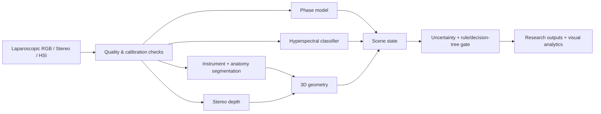

# SurgicalVision-3D

Research-oriented medical computer vision framework for laparoscopic surgery combining **surgical phase recognition, instrument/anatomy segmentation, hyperspectral tissue analysis, stereo depth estimation, camera calibration, geometric reconstruction, uncertainty-aware decision logic, and 3D surgical scene understanding**.

> Research software only. Not a medical device and not for autonomous clinical decision-making.

## Research modules

| Module | Purpose |
|---|---|
| `src/surgicalvision3d/phase` | Temporal surgical phase recognition |
| `src/surgicalvision3d/segmentation` | Instrument + anatomy segmentation |
| `src/surgicalvision3d/hyperspectral` | Spectral-spatial tissue classification |
| `src/surgicalvision3d/stereo` | Calibration, rectification, disparity, depth |
| `src/surgicalvision3d/geometry` | Point cloud, registration, mesh reconstruction |
| `src/surgicalvision3d/safety` | Failure-mode detection and decision trees |
| `src/surgicalvision3d/evaluation` | Metrics, uncertainty and explainability |
| `notebooks/` | Reproducible research walkthroughs |
| `assets/` | Architecture and qualitative SVG figures |

## End-to-end flow



## Quick start

```bash
python -m venv .venv
source .venv/bin/activate  # Windows: .venv\Scripts\activate
pip install -e .[dev]
pytest -q
```

## Design principles

1. **Reproducible**: configs, deterministic seeds and metric provenance.
2. **Modular**: perception components can be trained/evaluated independently.
3. **Geometry-aware**: stereo and 3D reconstruction are first-class modules.
4. **Safety-aware research**: low-confidence or invalid geometry routes to explicit fallback states.
5. **Data-conscious**: examples use synthetic/public-style placeholders; no patient data is bundled.

## Planned research tasks

- temporal phase recognition with CNN/ViT encoders and GRU/Transformer heads;
- multi-class instrument/anatomy segmentation with Dice/CE objectives;
- spectral-spatial tissue classification and HSI reconstruction;
- stereo calibration, rectification, disparity confidence and metric depth;
- point-cloud registration, normals, surface reconstruction and geometric error metrics;
- explainability, calibration curves, uncertainty and failure-case analysis.

## License

See [`LICENSE`](LICENSE).
