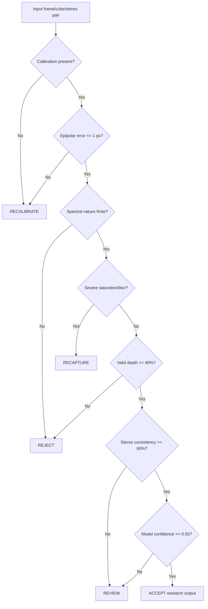

# Exception Handling Decision Tree

The decision layer is **research quality-control**, not a clinical decision system.

## Why explicit routing?
A numerical model can return a prediction even when the acquisition is invalid. The tree makes such assumptions visible and testable. Thresholds are engineering defaults for experiments, not clinically validated values.
